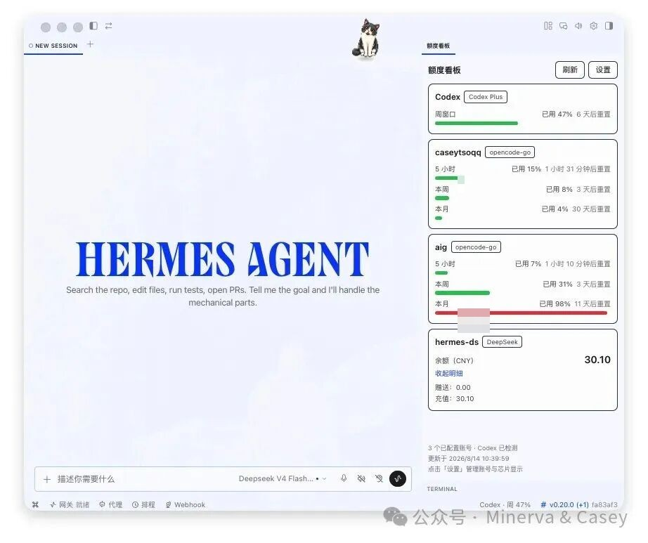

# 额度看板（usage-kanban）

> **中文（简体）** · [**English**](README.md)

Hermes 桌面端插件：在一个右侧 pane 里查看各家大模型 API 额度快照，并在状态栏芯片上瞟一眼最紧张的额度。中文版说明（可与此处互相切换）。

## 效果截图



## 支持的数据源

- **Codex Plus**：周额度（自动检测本机 ~/.codex/auth.json，无需填 key）
- **Antigravity（CLIProxyAPI）**：自动检测本机 ~/.cli-proxy-api/auth/antigravity-*.json 凭证；监控 Gemini（5小时/本周）与 Claude/GPT（5小时/本周）四个额度窗口，并展示订阅标识（如 Google AI Pro / Antigravity）
- **opencode-go**：每个 API key 的 5 小时 / 本周 / 本月三档窗口
- **DeepSeek**：余额（总额 + 赠送/充值明细，可展开）

## 安装

### 1. 桌面插件（保存即热更新，官方支持 symlink）

```bash
ln -s "$PWD" ~/.hermes/desktop-plugins/usage-kanban
```

或把本目录整体拷贝到 ~/.hermes/desktop-plugins/usage-kanban。
注意：目录名必须等于插件 id（usage-kanban）。

### 2. Python 后端（需重启 gateway 才生效）

```bash
mkdir -p ~/.hermes/plugins/usage-kanban/dashboard
cp dashboard/manifest.json dashboard/plugin_api.py ~/.hermes/plugins/usage-kanban/dashboard/
```

然后在 ~/.hermes/config.yaml 的 plugins.enabled 列表中加入 usage-kanban，并**重启 Hermes gateway**。
重启前看板会显示"后端不可用"提示，属正常现象。

### 3. 添加账号

打开设置页（侧边栏「额度看板设置」，或 pane 右上角「设置」）：

- **opencode-go**：别名 + API key（明文存储在后端目录 accounts.json，界面只显示脱敏尾号）
- **DeepSeek**：同上
- **Codex Plus**：无需配置，检测到 ~/.codex/auth.json 自动出现
- **Antigravity**：无需配置，后端自动发现 ~/.cli-proxy-api/auth/antigravity-*.json，自动管理

## 设置项

- **状态栏芯片显示模式**：固定订阅（自选显示哪一个）/ 自动（异常优先，无异常显最紧张项）/ 始终最紧张项 / 始终异常计数
- **DeepSeek 金额警戒**：余额低于黄线/红线变黄/红（默认 10 元 / 2 元，可改）
- **百分比窗口高亮与显示**：剩余 < 20% 黄、< 5% 红；对 0%~1% 的微量消耗值保留两位小数（如 0.02%），避免被截断显示为 0%
- **账号隐藏开关**（隐藏的账号不出现在看板与芯片）

## 数据来源说明

- Codex Plus 的 `wham/usage`、opencode-go 的 `zen/go/v1/usage` 以及 Antigravity 的 `daily-cloudcode-pa.googleapis.com` 内部接口是客户端/反代使用的**非公开接口**，可能随上游调整而变化；接口异常时对应卡片会显示清晰隔离的错误原因。
- Antigravity 支持通过环境变量 `CLIPROXY_PROXY_URL` 指定 HTTP/HTTPS 代理，并默认从 `~/.cli-proxy-api/config.yaml` 的顶层 `proxy-url` 读取本机代理；stdlib 后端不支持 SOCKS，使用 SOCKS 的用户需为该环境变量提供 HTTP/HTTPS 代理入口。凭证目录支持 `CLIPROXY_AUTH_DIR` 覆盖。Token 续期完全依赖 CLIProxyAPI，后端严格只读，不回写凭据，也不泄露任何 token、project id 或代理认证信息。
- DeepSeek balance 为官方公开接口。
- 所有请求由 Python 后端统一代理（见 docs/adr/0001-provider-traffic-via-python-backend.md）。

## 目录结构

```text
plugin.js                  桌面插件（单文件，全部逻辑内联）
dashboard/manifest.json    后端清单
dashboard/plugin_api.py    后端：额度聚合 + 账号/设置存储 + Codex token 自动续期 + Antigravity 凭据发现与配额汇总
CONTEXT.md                 领域术语表
docs/adr/                  架构决策记录
research/                  调研笔记（额度 API、SDK 事实、视觉验收备注）
FACTS.md                   Hermes 插件 SDK 事实核查报告
tests/                     单元测试集（stdlib unittest）
```

## 常见问题

- **看板显示"后端不可用"**：config.yaml 未启用或 gateway 未重启（见安装第 2 步）。
- **Codex 卡片报"会话已过期"**：在 Codex CLI 里重新登录（codex login）。
- **Antigravity 卡片报 401**：凭证已过期或无效，等待 CLIProxyAPI 自动续期或在反代中重新授权。
- **Antigravity 卡片报网络/代理错误**：请检查 `CLIPROXY_PROXY_URL` 环境变量或 `~/.cli-proxy-api/config.yaml` 中的 `proxy-url` 配置。
- **opencode-go 报 403**：该 key 没有 Go 订阅。
- **想加新 provider**：后端加一个 fetch 函数 + /status 聚合，前端加一张卡片即可（provider/account 抽象已预留）。

## 许可

Copyright (C) 2026 CaseyTso

本项目以 GNU Affero General Public License v3.0（AGPL-3.0）发布，全文见 LICENSE。
